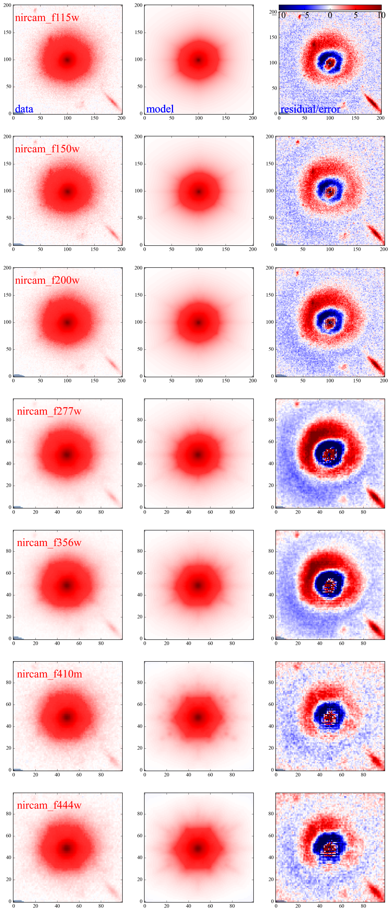
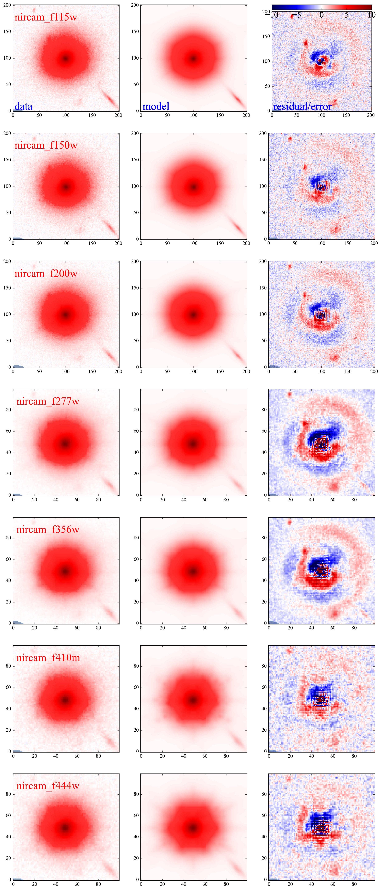
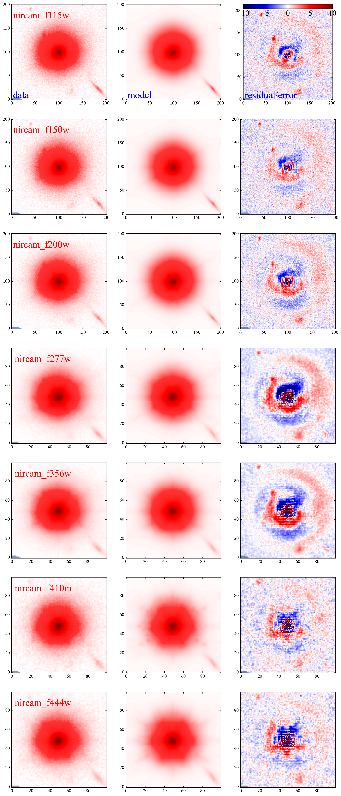
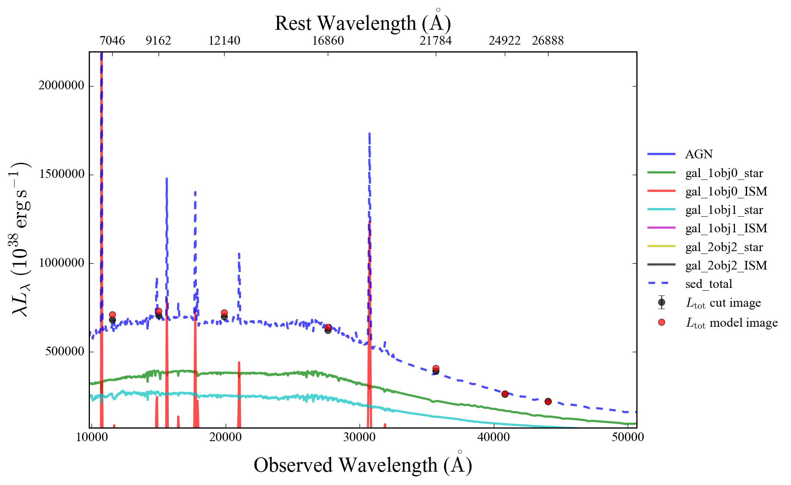
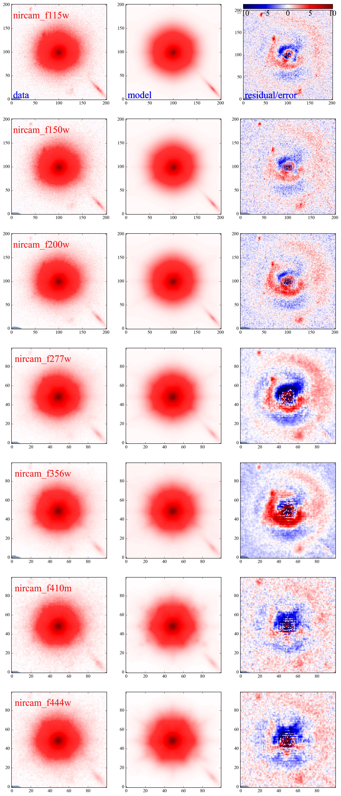
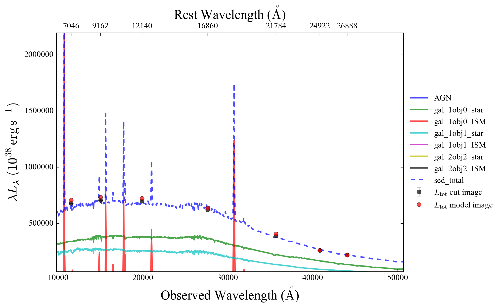

# 这是一个AGN + Bulge + Disk + company galaxy的example

## Pure Image fitting 

### 1. Single sersic（1）

首先先用一个single sersic model 拟合, 可以看到至少有中心亮源（可能的中心点源），外围延展结构（需要多个sersic model）和右下角明显的伴星系（可能非同红移）。

### 2. 添加延展sersic model（3）

初始参数按照GalfitX的输出(我是用photutils进行探测，本质上差不多)，分别给中心大源和旁边星系一个sersic, 看到基本上外围亮度可以被拟合。

### 3. 尝试添加AGN， 

尝试在上一步的基础上添加一个点源agn， 残差看上去没啥变化但是BIC 有所降低，暂时接受AGN（影响不大？）

剩余的残差属于星系本身的复杂性和不对称，很难用参数化的模型描述，次级结构不影响想要参数的测量。

## SED 拟合

### 1.固定先前确定的几何参数， 拟合sed参数，发现基本可以吻合， 但是残差略有变差，因为加了限制。

### 2.采用前一步的sed 参数和最开始的几何参数作为initial guess, 参去拟合所有参数，看是否能收敛到一起。

