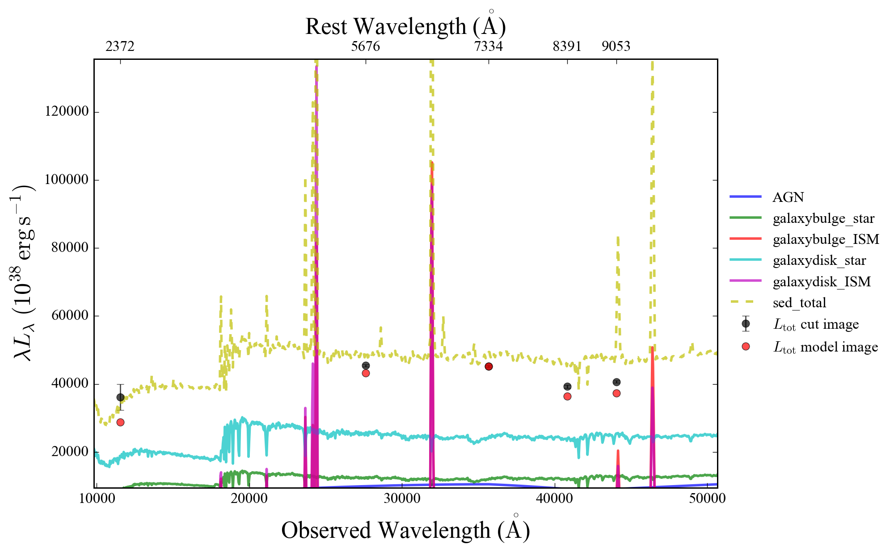
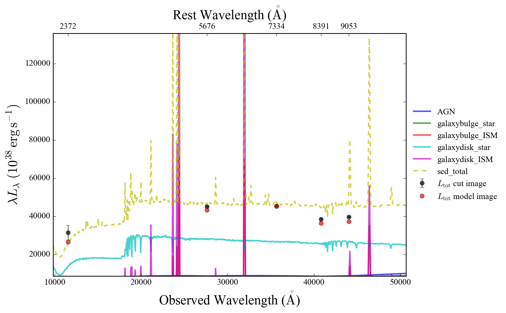

# 这是一个AGN + Bulge + Disk 的example 

##
由于不同波段天区覆盖范围有略微不同，所以这个源只有5个band

## Pure Image fitting 

### 1. Point Source 
首先用一个点源(point source)来拟合, 发现明显延展结构

### 2. 添加延展sersic model 1

初始参数设置成GalfitX的输出，发现长波波段仍有明显residual, 尝试添加第二个sersic。

### 3. 添加sersic model 2

发现redisual 基本消失，基本确定几何参数，例如Re, n, PA(position angle), Xcen, Ycen.

## SED 拟合

### 1.固定先前确定的几何参数， 拟合sed参数，发现基本可以吻合， 但是残差略有变差，因为加了限制。

### 2.采用前一步的sed 参数和最开始的几何参数作为initial guess, 参去拟合所有参数，看是否能收敛到一起。

